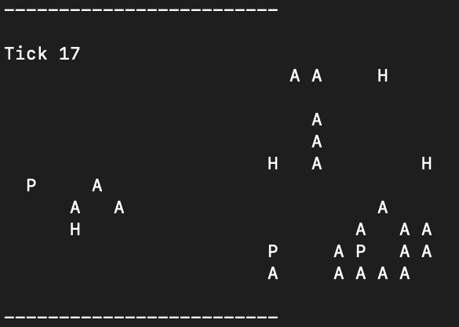

# 🌊 Living Ocean — C++ Simulation

A simple simulation of an oceanic ecosystem written in C++. It models the behavior of algae, herbivorous and predatory fish in a 2D grid. The project uses key concepts of modern C++: OOP, templates, smart pointers, exceptions, RAII, Rule of Five, and Pimpl idiom.



## 🧩 Description

The project simulates an ocean environment with the following entities:

- **Sand** — an empty cell  
- **Algae** — algae that grow and reproduce  
- **HerbivoreFish** — herbivorous fish that eat algae  
- **PredatorFish** — predatory fish that hunt herbivorous fish  

On each time step (tick), all living organisms update their state:
- Movement  
- Searching for food  
- Reproduction  
- Death from hunger or old age  

## 🔧 Requirements

- C++17
- CMake ≥ 3.14
- make/g++
- OS: Windows, Linux or macOS

## 🚀 How to Build and Run

### Clone the repository
```bash
git clone https://github.com/yourusername/ocean-simulation.git 
cd ocean-simulation
```
### Create build directory and compile
```bash
mkdir build && cd build
cmake .
make
```
### Run the simulation
```bash
./ocean_simulation
```
