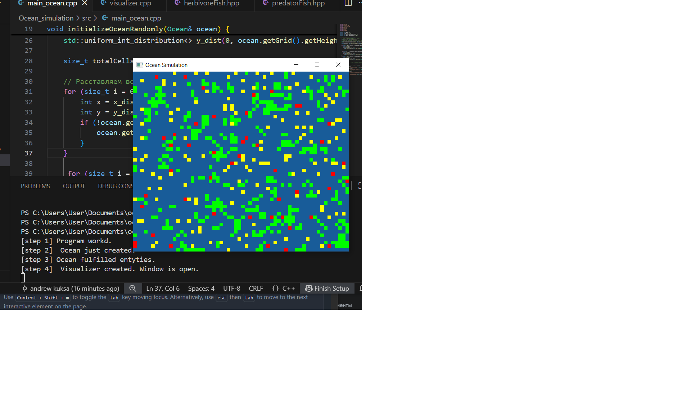

# Ocean — C++ Simulation

This project is a simple simulation of an oceanic ecosystem written in C++. It models the behavior of algae, herbivorous fish, and predatory fish within a 2D grid.

The simulation emphasizes modern C++ principles, including Object-Oriented Programming (OOP), templates, smart pointers (RAII), exception handling, and common C++ idioms. The graphics are rendered using the SFML library.



## ⚙️ How It Works

The ocean is represented as a grid where each cell can contain one of the following entities:

Sand: An empty, inert cell.

Algae: Grows and reproduces in adjacent empty cells.

HerbivoreFish: Eats algae to survive and may die of hunger or old age.

PredatorFish: Hunts HerbivoreFish and may also die of hunger or old age.

The simulation progresses in time steps, or "ticks." During each tick, organisms perform actions such as moving, searching for food, reproducing, and potentially dying.

## 🔧 Prerequisites


To build and run this project, you will need:

A C++17 compliant compiler (like g++)

CMake (version 3.14 or higher)

Make

SFML 2.5+: The graphics library used for visualization. You can download it from the official SFML website.

The project is compatible with Windows, Linux, and macOS.

## 🚀 How to Build and Run

### Clone the repository
```bash
git clone https://github.com/yourusername/ocean-simulation.git 
cd ocean-simulation
```
### Create build directory and compile
```bash
mkdir build && cd build
cmake .
make
```
### Run the simulation
```bash
./ocean_simulation
```
